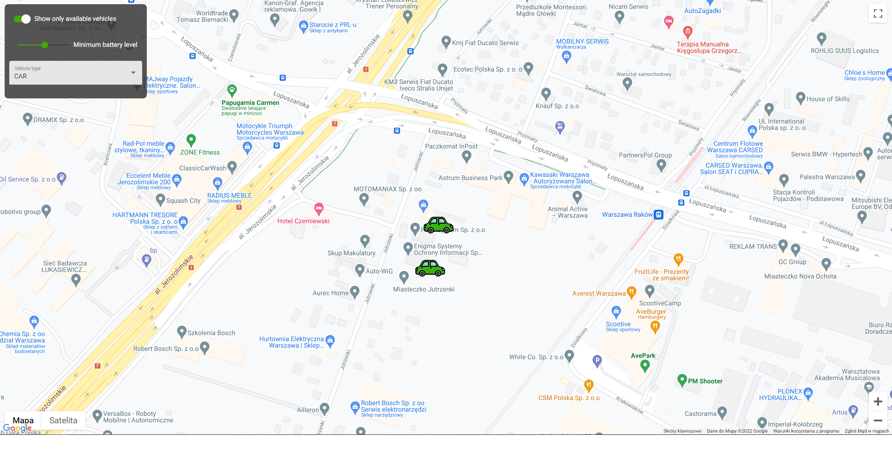

# AngularMap

This project displays the location of vehicles on the map. Vehicles data comes from API. You can filter vehicles by availability status, battery level and vehicle type. After clicking on the vehicle, the details are displayed in the modal window.

## Libraries

- Angular google maps
- Angular material

## Live view

https://evescolded.github.io/Angular-map/
